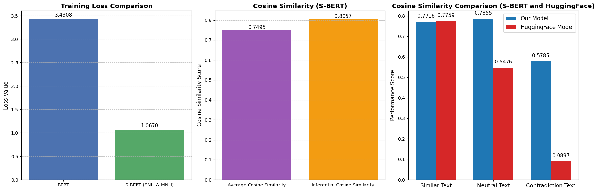
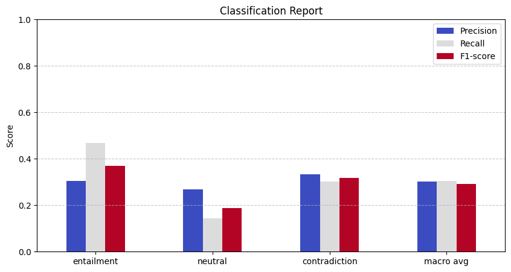
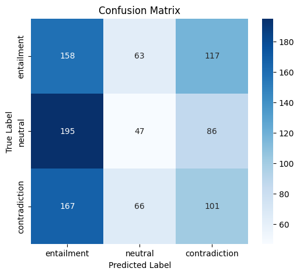
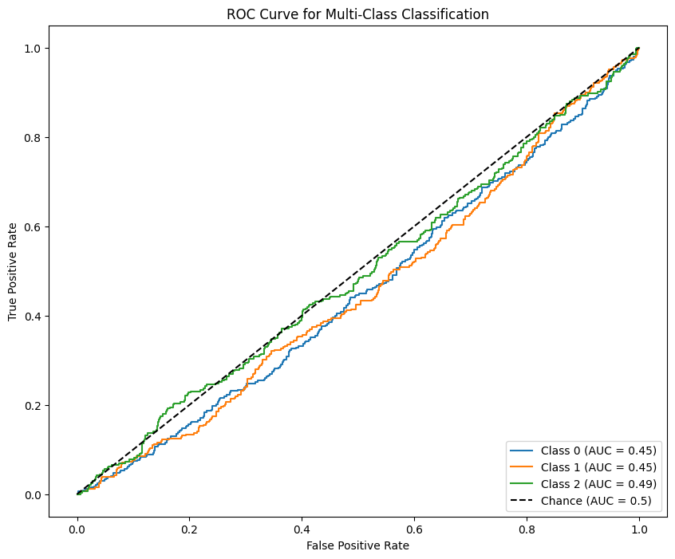
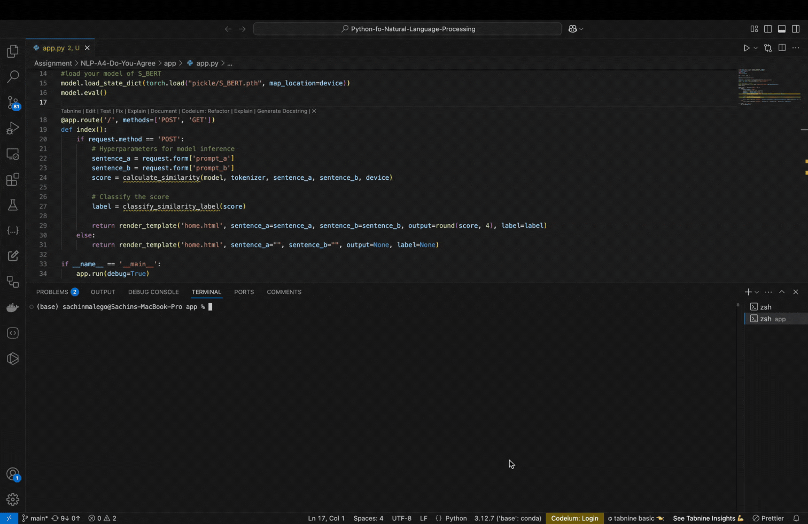
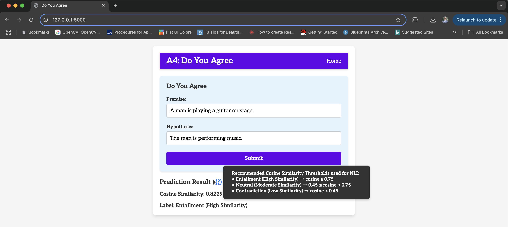

# NLP-A4-Do-you-agree
BERT and SBERT

#### 1) Provide the performance metrics based on the SNLI or MNLI datasets for the Natural Language Inference (NLI) task.

Below is the training loss of BERT and S-BERT models

| Model Type | Training Loss |
|------------|--------------------------|
| BERT       | 3.430801                  |
| S-BERT (SNLI and MNLI)      | 1.066953                   |

Cosine Similarity S-BERT model
| Metric                        | Cosine Similarity |
|------------------------------|------------------|
| **Average Cosine Similarity**   | 0.7495           |
| **Inferential Cosine Similarity** | 0.8057           |

Performance metrics and comparision to the our model with huggingface model.
| Model Type | SNLI or MNLI Performance |
|------------|--------------------------|
| **For Similar Text** |
| Our Model  | 0.7716 |
| HuggingFace Model | 0.7759 |
| **For Neutral Text** |
| Our Model  | 0.7855 |
| HuggingFace Model | 0.5476 |
| **For Contradiction Text** |
| Our Model  | 0.5785 |
| HuggingFace Model | 0.0897 |

**Fig 1.** Performance Graph

**Classification Report**
| Class            | Precision | Recall | F1-Score | Support |
|------------------|-----------|--------|----------|---------|
| Entailment       | 0.30      | 0.47   | 0.37     | 338     |
| Neutral          | 0.27      | 0.14   | 0.19     | 328     |
| Contradiction    | 0.33      | 0.30   | 0.32     | 334     |
| **Accuracy**     |           |        | 0.31     | 1000    |
| **Macro avg**    | 0.30      | 0.30   | 0.29     | 1000    |
| **Weighted avg** | 0.30      | 0.31   | 0.29     | 1000    |

**Fig 1.** Classification Report Graph

**Fig 2.** Confusion Matrix

**Fig 3.** ROC Curve for Multiclass classification

---

#### 2) Discuss any limitations or challenges encountered during the implementation and propose potential improvements or modifications.

### Observations:
**Inference Cosine Similarity:**
Our model maintains very high inference cosine similarity measurements near 1 for similar sentences because it performs well at capturing semantic relationships. The pretrained model from hugging face displays an equivalent performance to our model by achieving nearly perfect cosine similarity scores for sentence pair matching.  

**Confusion Matrix Analysis:**
The confusion matrix demonstrates how the model performs its classification duties between entailment, neutral and contradiction context.
Of the entailment class predictions the model achieved 158 cases of accuracy while making 117 mistakes as contradiction and 63 misclassifications as neutral.
The model shows poor performance on neutral predictions since 195 examples were wrongly identified as entailments yet it managed to identify 47 instances correctly.
Among the contradiction examples 101 were identified correctly yet 167 examples were misclassified as entailment type.  

Key Observations:
The model demonstrates poor capability to separate neutral sentences because it commonly mistakes them for entailment.
The similarities between entailed and contradictory statements result in excessive misidentification of these classes.
Inadequate feature representation seems to be a problem since the model cannot properly distinguish between semantic contradictions and similarities.  

Potential Fixes:
The training data requires improved distribution of classes throughout its sample data.
Revised loss functions such as contrastive loss may help to enhance performance.
The addition of extra labeled data through fine-tuning helps improve detection boundaries between entailment and contradiction.

**ROC Curve Analysis for Multi-Class Classification:**
Using the ROC curve technique allows assessment of how well the model identifies different classes. The AUC measurement for all three classes reveals unimpressive results where values remain below 0.5.

- Class 0 (AUC = 0.45)
- Class 1 (AUC = 0.45)
- Class 2 (AUC = 0.49)
  
The model demonstrates inferior performance than random chance since its values remain below 0.5 as indicated by the dashed line of AUC = 0.5.

Key Observations:
The model displays inadequate discrimination capability between classes therefore showing poor predictive performance.
The model indicates ineffective classification because its ROC curves stay near the random chance line.  

Potential Fixes:
Better embeddings should be used to enhance the way features are represented.
Hyperparameter tuning to optimize learning.
The system needs class rebalancing procedures to ensure equal training of all categories.
The implementation of focal loss functions serves classes better during unbalanced distribution scenarios.

### Limitations or Challenges:
- BERT reveals excessive training loss of 3.43 when compared to S-BERT's loss value of 1.07 which implies unproductive learning patterns for meaningful sentence embeddings.
- The classificaton report indicates minimal precision and recall performance together with F1-scores where neutral texts achieved 0.19 and entailment classes reached 0.37 scores respectively.
- The inferential cosine similarity measurement at 0.8057 exceeds the normal average similarity value of 0.7495 thus indicating inconsistent semantic relationship detection across diverse text domains.
- In comparision of cosine similarity with HuggingFace model, our model performs not that good at metrics in neutral (0.7855 vs. 0.5476), contradiction (0.5785 vs. 0.0897) and identifying similar (0.7716 vs. 0.7759) texts. It can be because of the small set of data used for training.

### Potential Improvements or Modifications:
- The performance and training loss reduction may be improved by modifying learning rate together with adjusting batch size and dropout rate parameters.
- The model performance may increase if pre-trained sentence embeddings like MPNet and MiniLM replace BERT embeddings directly during semantic processing.
- The model results would benefit from larger training datasets collections.
- The performance of models can potentially be boosted through alternative architecture choices between SimCSE and Knowledge Distillation as well as T5 and RoBERTa transformer frameworks.

---

### Documentation:
- **Datasets Used:** 
Link to dataset: https://huggingface.co/datasets/bookcorpus/bookcorpus  
BookCorpus serves as a large text corpus which contains 11,000 books in its free access and has 74 million sentences and 1 billion words at its total count. The authors Zhu et al. (2015) established this dataset for linking text sequences with picture sequences. BookCorpus stands out from Wikipedia and news datasets because it holds long narrative books suitable for pretraining BERT, GPT, RoBERTa and T5 language models. The structure of BookCorpus enables extensive use in both sentiment analysis and chatbot technology because it contains diverse contextual information.  

    BookCorpus provides multiple advantages to its users but includes distinct adverse features. The collection of books originated from Smashwords without licensing authorization points to possible copyright infringements. The BookCorpus platform mostly handles fiction literature but romance novels make up the majority of its content which limits this resource for dealing with technical along with factual material. Quality problems exist within the dataset since it contains duplicate records and grammatical errors are present.  

    The combination of BookCorpus with Wikipedia and Common Crawl and OpenWebText and C4 provides researchers with an improved basis to enhance their factual accuracy and generalization capabilities. Modern NLP research employs legally licensed and diverse well-curated options as BookCorpus alternatives because these collections improve model functioning along with meeting ethical requirements.

- **Hyperparameters:**
n_layers = 12    # number of Encoder of Encoder Layer
n_heads  = 12    # number of heads in Multi-Head Attention
d_model  = 768  # Embedding Size
d_ff = d_model * 4  # 4*d_model, FeedForward dimension
d_k = d_v = 64  # dimension of K(=Q), V
n_segments = 2
batch_size = 32

---
### Web application can be accessed locally:  
To deploy application first download repo from github (https://github.com/sachinmalego/NLP-A4-Do-you-agree.git).   
Open in VSCode and open terminal.  
In the terminal type "python3 app.py". My local deployment address was "http://127.0.0.1:5000/" however your's might be different.  
Go to browser and enter your local deployment server address to test the application. 

Video of Working application:  
Link to video: https://drive.google.com/file/d/1X4pOMNefoT4ic3z-tcPTREKUicmEEdEO/view?usp=sharing

Screen shots of the working application is attached here with: 

